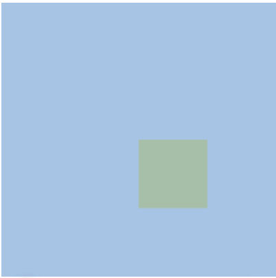
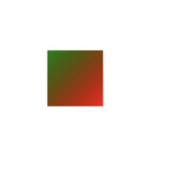

# canvas 简介

毋庸置疑，`<canvas>` 是 HTML5 最受欢迎的新特性。这个元素会占据一块页面区域，让 JS 可以在上面动态绘制图片。与浏览器环境中的其他部分一样，canvas 自身提供了一些 API，但并非所有浏览器都支持这些 API，其中包括支持基础绘图能力的 2D 上下文和被称为 WebGL 的 3D 上下文。

## 1. 基本的画布功能
创建 `<canvas>` 元素时**至少要设置其 width 和 height 属性**，这样才能告诉浏览器在多大面积上绘图。比如：

```html
<canvas id='drawing' width='200' height='200'>A drawing of something.</canvas>
```

在上面的例子中，**width 和 height 属性是设置在标签属性中的，而不是 style 中**。如果不设置 width 和 height 属性，画布的默认大小为 300 x 150。

要在画布上绘制图形，首先要**取得绘图上下文**。我们可以使用 `getContext()` 方法获取**对绘图上下文的引用**。
> 对于平面图形，需要给这个方法传入参数 '2d'，如果是三维图形，则传入 'webgl' 或 'webgl2'。（详情可以看 [JS 文档](https://developer.mozilla.org/zh-CN/docs/Web/API/HTMLCanvasElement/getContext)）

使用方法如下：

```js
let drawing = document.querySelector('#drawing');
// 判断浏览器是否支持 canvas
if(drawing.getContext){
    let context = drawing.getContext('2d');
    //... other drawing code
}
```

## 2. 2D 绘图上下文

2D 绘图上下文提供了绘制 2D 图形的方法，包括矩形、弧形和路径等。**2D 上下文的坐标原点 (0, 0) 在 canvas 元素的左上角**。所有坐标值都相对于该点计算，因此 x 坐标向右增长，y 坐标向下增长。
> 默认情况下，width 和 height 表示两个方向上像素的最大值。

### 填充和描边
2D 上下文有两个基本绘制操作：**填充**和**描边**。填充以指定样式（颜色、渐变或图像）自动填充形状，而描边只为图形边界着色。大多数 2D 上下文操作有填充和描边的变体，显示效果取决于两个属性：`fillStyle` 和 `strokeStyle`。

这两个属性可以是字符串、渐变对象或图案对象，默认是都是 `#000000`。字符串表示颜色值，可以是 CSS 支持的任意格式：名称、十六进制代码、rgb、rgba、hsl 或 hsla。比如：


```js
let drawing = document.querySelector('#drawing');
if(drawing.getContext){
    let context = drawing.getContext('2d');
    context.fillStyle = '#0000ff';
    context.strokeStyle = 'red';
}
```

这里把 strokeStyle 设置为 `red`，把 fillStyle 设置为 `#0000ff`。**后续的所有与描边和填充相关的操作都会使用这两种样式，除非再次修改**。

### 绘制矩形
矩形是唯一一个可以直接在 2D 绘图上下文中绘制的形状。与绘制矩形相关的方法有 3 个：
`fillRect()`、`strokeRect()` 和 `clearRect()`。这些方法都接收 4 个参数：
+ 矩形 x 坐标（左上角）
+ 矩形 y 坐标（左上角）
+ 矩形宽度
+ 矩形长度

`fillRect()` 方法用于以指定颜色在画布上绘制并填充矩形，填充的颜色使用 `fillStyle` 属性来设置，如：

```js
let drawing = document.querySelector('#drawing');
let context = drawing.getContext('2d');
context.fillStyle = '#fff000';
context.fillRect(0, 0, 50, 50);
context.fillStyle = '#ff0000';
context.fillRect(50, 50, 50, 50);
```

上面的例子是在画布的 0, 0 位置绘制了一个长宽均为 50 的黄色矩形，在 50, 50 的位置绘制了一个长宽均为 50 的红色矩形。

`strokeRect()` 方法使用通过 `strokeStyle` 属性指定的颜色绘制**矩形轮廓**。如：

```js
let drawing = document.querySelector('#drawing');
let context = drawing.getContext('2d');
context.strokeStyle = '#fff000';
context.strokeRect(0, 0, 50, 50);
context.strokeStyle = '#ff0000';
context.strokeRect(50, 50, 50, 50);
```

以上代码同样绘制了两个重叠的矩形，不过只有轮廓，而不是实心的。

使用 `clearRect()` 方法可以擦除画布中某个区域。该方法用于把绘图上下文中的某个区域变为透明。通过先绘制形状再擦除指定区域，可以创建出有趣的效果，比如从已有矩形中开个孔。看个例子：

```js
let drawing = document.querySelector('#drawing');
let context = drawing.getContext('2d');
context.fillStyle = '#fff000';
context.fillRect(0, 0, 50, 50);
context.fillStyle = '#ff0000';
context.fillRect(30, 30, 50, 50);
// 清除某一块区域
context.clearRect(40, 40, 10, 10);
```


### 绘制路径
2D 绘图上下文支持很多在画布上绘制路径的方法。通过路径可以创建复杂的形状和线条。要绘制路径，必须首先调用 `beginPath()` 方法以表示要开始绘制新路径。然后再调用下列方法来绘制需要的效果：

+ **arc(x, y, radius, startAngle, endAngle, counterclockwise)**：以坐标(x, y) 为圆心，以 radius 为半径绘制一条弧线，起始角度为 startAngle，结束角度为 endAngle，counterclockwise 表示是否逆时针（默认为顺时针）。
+ **arcTo(x1, y1, x2, y2, radius)**：以给定半径 radius，经由 (x1, y1) 绘制一条从上一点到 (x2, y2) 的弧线。
+ **bezierCurveTo(c1x, c1y, c2x, c2y, x, y)**：以 (c1x, c1y) 和 (c2x, c2y) 为控制点，绘制一条从上一点到 (x, y) 的弧线（三次贝塞尔曲线）。
+ **lineTo(x, y)**：绘制一条从上一点到 (x, y) 的直线。
+ **moveTo(x, y)**：不绘制线条，只把绘制光标移动到（x, y）。
+ **quadraticCurveTo(cx, cy, x, y)**：以 (cx, cy) 为控制点，绘制一条从上一点到 (x, y) 的弧线（二次贝塞尔曲线）。
+ **rect(x, y, width, height)**：以给定宽度和高度在坐标点 (x, y) 绘制一个矩形（矩形的左上角为 x, y）。这个方法与 `strokeRect()` 和 `fillRect()` 的区别在于，它创建的是一条路径，而不是独立的图形。


我们**使用 `beginPath()` 创建路径，之后可以使用 `closePath()` 方法绘制一条返回起点的线，这样算完成一次路径绘制**。此后其他绘制的内容将与之无关，下一次绘制中调用 fill 和 stroke 方法（下面会讲）也不会在上一次绘制中起到作用。

如果路径已经完成，则既可以指定 `fillStyle` 属性并调用 `fill()` 方法来填充路径，也可以指定 `strokeStyle` 属性并调用 `stroke()` 方法来描画路径，还可以调用 `clip()` 方法基于已有路径创建一个新剪切区域。


```js
let drawing = document.querySelector('#drawing');
let context = drawing.getContext('2d');
// 绘制一个黄色的实心圆
context.beginPath();
context.arc(50, 50, 25, 0, 2 * Math.PI, false);
context.fillStyle = '#fff000'
context.fill();
context.closePath();

// 绘制一个蓝色的空心圆
context.beginPath();
// 要先移动到 125, 100 的位置，否则会出现上一个圆结束为止到当前圆绘制开始位置的连线
context.moveTo(125, 100);
context.arc(100, 100, 25, 0, 2 * Math.PI, false);
context.strokeStyle = '#00ffff'
context.stroke();
context.closePath();

// 绘制一个红色的三角形
context.beginPath();
context.moveTo(150, 150);
context.lineTo(200, 200);
context.lineTo(150, 200);
context.fillStyle = '#ff0000'
context.fill();
context.closePath();
```

效果如下：


使用路径绘制，可以创建涉及各种填充样式、描述样式等的复杂图像。

### 绘制文本
文本和图像混合也是常见绘制需求，因此 2D 绘图上下文还提供了绘制文本的方法，即 `fillText()` 和 `strokeText()`。这两个方法都接收 4 个参数：
+ **要绘制的字符串**
+ **字符串 x 坐标**
+ **字符串 y 坐标**
+ **文本最大宽度**

这两个方法最终绘制的结果还依赖三个属性：

+ **font**：以 CSS 语法指定的字体样式、大小、字体族等，比如 “bold 14px Arial“。
+ **textAlign**：指定文本的对齐方式（水平角度），可能的值包括："start"、"end"、"left"、"right"、"center"。
+ **textBaseLine**：指定文本的基线（垂直角度），可能的值包括："top"、"hanging"、"middle"、"alphabetic"、"ideographic" 和 "bottom"。

这些属性都有相应的默认值，因此没必要每次绘制文本时都设置它们。`fillText()` 方法使用 `fillStyle()` 属性绘制文本，而 `strokeText()` 方法使用 `strokeStyle` 属性。通常，`fillText()` 方法是使用的最多的，因为它模拟了在网页中渲染文本。举个例子：

```js
context.font = "bold 14px Arial";
context.textAlign = "center";
context.textBaseLine = "middle";
context.fillText("hello world", 100, 100); // 字符串中心位置在 100, 100
context.strokeText("hello world", 150, 150);
```

效果如下：


此外，`fillText()` 和 `strokeText()` 方法的第四个参数为**文本最大宽度**，如果绘制的字符串超出了最大宽度限制，则文本会被**压缩**到最大宽度的长度。

### 变换
上下文变换可以操作绘制在画布上的图像，2D 绘图上下文支持所有常见的绘制变化。主要包括：旋转、缩放、移动等变化：

+ **rotate(angle)**：围绕原点把图像旋转 angle 角度。
+ **scale(scaleX, scaleY)**：通过在 x 轴乘以 scaleX，在 y 轴乘以 scaleY 来缩放。默认值为 1.0。
+ **translate(x, y)**：把**原点**移动到 (x, y)。执行这个操作后，坐标 (0, 0) 就会变为 (x, y)。
+ **transform(m1_1, m1_2, m2_1, m2_2, dx, dy)**：设置变形矩阵，通过矩阵乘法直接修改。其中 m1_1 表示水平缩放，m1_2 表示垂直旋转角度，m2_1 表示水平旋转角度，m2_2 表示垂直缩放，dx 表示水平移动，dy 表示垂直移动。
+ **setTransform(m1_1, m1_2, m2_1, m2_2, dx, dy)**：把矩阵重置为默认值，再以传入的参数调用 `transform()` 方法。
+ **resetTransform()**：重置当前变形矩阵为单位矩阵。

```js
let drawing = document.querySelector('#drawing');
let context = drawing.getContext('2d');
context.translate(100, 100); // 把原点设置为 100， 100
context.fillStyle = '#fff000';
context.fillRect(0, 0, 50, 50);
```

为了更清晰的表现正方形在画布中的位置，给画布背景设置为浅蓝色。效果如下：

;

### 保存设置

上面我们讲到了很多属性设置，如 fillStyle、strokeStyle 和变换等。我们可以通过 `save()` 方法保存设置，这样可以把当前时刻的设置都保存到一个**暂存栈**中，之后绘制都会采用栈顶的设置。如果需要回到上一时刻的设置，可以通过 `restore()` 方法从暂存栈中取出并恢复之前保存的设置。如：

```js
context.fillStyle = 'red';
context.save();

context.fillStyle = 'blue';
context.translate(100, 100);
context.save();

context.fillStyle = 'green';
context.fillRect(0, 0, 100, 100); // 在原始画布 100， 100 位置绘制 100 x 100 的绿色矩形

context.restore();
context.fillRect(10, 10, 100, 100); // 在原始画布 100， 100 位置绘制 100 x 100 的蓝色矩形

context.restore();
context.fillRect(0, 0, 100, 100); // 在原始画布 0，0 位置绘制 100 x 100 的红色矩形
```

### 绘制图像
2D 绘图上下文内置支持操作图像，如果想把现有图像绘制到画布上，可以使用 `drawImage()` 方法。这个方法可以接收**三组不同形式的参数**，并且会产生不同的结果，

最简单的调用是**传入一个 HTML 的 img 元素或其他 canvas 元素，以及该元素的绘制位置 x 和 y**：

```js
let img = document.querySelector("#myImg");
context.drawImage(img, 10, 10);
```

第二种调用方法相较于上一种方法，多了两个参数：宽和高。
```js
// 在 10, 10 位置绘制 30 x 30 的 img
context.drawImage(img, 10, 10, 30, 30);
```

第三种调用方法提供 9 个参数，相比于第二种方法多了 4 个参数：**目标区域 x 坐标、目标区域 y 坐标、目标区域宽度和目标区域高度**
```js
// 目标区域为 (0, 0) 开始的 50 x 50 的区域，如果图片都在这个区域内就能全看到，反之只能看到一部分图片
context.drawImage(img, 10, 10, 30, 30, 0, 0, 50, 50);
```

### 渐变
要创建先行渐变，可以通过调用 `createLinearGradient()` 方法。这个方法接收 4 个参数：起点 x、起点 y、终点 x、终点 y。调用之后，该方法会以指定大小创建一个新的 `CanvasGradient` 对象并返回示例。
```js
let gradient = context.createLinearGradient(30, 30, 70, 70)；
```
有了 gradient 对象后，接下来要使用 `addColorStop()` 方法为渐变指定色标。这个方法接收两个参数：**色标位置**和 **CSS颜色字符串**。色标位置通过 0 ～ 1 范围内的值表示，0 是第一种颜色，1 是最后一种颜色。如：

```js
gradient.addColorStop(0, 'green');
gradient.addColorStop(1, 'red');
```

这个 gradient 对象现在表示的就是**在画布上从 (30, 30) 到 (70, 70) 绘制一个渐变。渐变起点颜色为绿色，终点颜色为红色**。我们也可以把这个对象赋给 `fillStyle` 或 `strokeStyle` 属性，从而以渐变颜色填充或描画绘制的图形，如：

```js
context.fillStyle = gradient;
context.fillRect(30, 30, 40, 40);
```

效果如下：



## 3. 总结
上面介绍了 canvas 的 2D 绘图上下文的常用方法和 API。其实还有很多其他的方法，如阴影、图案、图像数据等。更多内容可以查看红宝书 p553 - p568 或 [官方文档](https://developer.mozilla.org/zh-CN/docs/Web/API/CanvasRenderingContext2D)。

