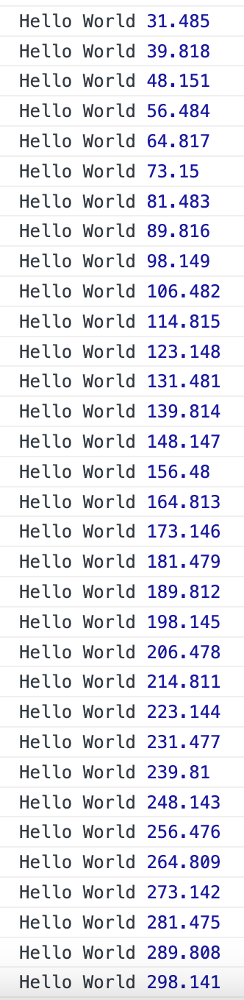

# 基于 requestFrameAnimation 实现 JS 动画

使用 CSS 实现动画，可以通过 `transition`、`animation` 等方法。那如何通过 JS 实现动画呢？其实很长时间以来，JS 都是基于计时器和定时执行实现动画的，如 `setTimeout` 和 `setInterval` 等。但是它们存在一个致命的问题：

> **不能保证时间精度**。作为第二个参数的 delay 只能保证何时会把代码添加到浏览器的任务队列，但不能保证添加到队列中就会立即执行。因为如果队列前面还有其他任务，那么就要等这些任务执行完再执行。因此，基于这两种方法的动画可能会出现动画不流畅的问题。

为此，`requestAnimationFrame()` 方法出现，故名思义 “**请求动画帧**”，也就**在浏览器渲染的每一帧中执行**。MDN 中是这样描述的：

> `window.requestAnimationFrame()` 告诉浏览器：你希望执行一个动画，并且要求浏览器在下次重绘之前调用指定的回调函数更新动画。该方法需要传入一个回调函数作为参数，该回调函数会在浏览器下一次重绘之前执行。

我们知道浏览器刷新频率是 1 分钟内至少 60 次，这样才能保证用户不会觉得卡顿。而浏览器在一帧内会做很多事情，如下图所示：


`requestAnimationFrame` 方法就被包含在这一帧中，该方法会**在浏览器重绘之前触发**。这个方法的好处就是：**能够知道什么时候触发其内部的回调函数，并且不需要人为设置时间间隔，其触发的时间间隔和浏览器的刷新频率一致（1s 60 次，大约 16.6 ms 一次）**。

## 1. 使用
即然已经介绍了什么是 `requestAnimationFrame` 及其执行时机，那么该如何使用呢？

首先，该方法接收一个参数：**回调函数**，表示会在重绘之前执行该回调函数。举个例子：

```html
<script>
    (function () {
        function test() {
            console.log('Hello World');
        }
        requestAnimationFrame(test);
    })()
</script>
```

上面的例子会打印一次 `Hello World`，但也就仅有一次，并没有出现连续打印。换而言之，如果执行动画的话，这也就只能执行一帧，不能连续下去。那该怎么办呢？

MDN 中是这么说的：

> 若你想在浏览器下次重绘之前继续更新下一帧动画，那么回调函数自身必须再次调用 `requestAnimationFrame()`。`requestAnimationFrame()` 是一次性的。

根据上面的说法，我们修改一下代码即可：

```html
<script>
    (function () {
        function test() {
            console.log('Hello World');
            requestAnimationFrame(test); // 新增代码
        }
        requestAnimationFrame(test);
    })()
</script>
```

上面代码就会一直打印 `Hello World`。

## 2. 回调参数

`requestAnimationFrame()` 内部的参数是一个回调函数（上个例子中就是 test 函数），该回调函数可以接收一个参数，此参数是一个 `DOMHighResTimeStamp` 实例（比如 `performance.now()` 的返回值）。

> `DOMHighResTimeStamp` 指示当前被 `requestAnimationFrame()` 排序的回调函数被**触发的时间**。

```html
<script>
    (function () {
        function test(time) {
            console.log('Hello World', time);
            requestAnimationFrame(test); // 新增代码
        }
        requestAnimationFrame(test);
    })()
</script>
```

上面代码每次打印时都会打印 `DOMHighResTimeStamp` 实例，结果如下：



从上图可知，大约每隔 8.3 ms 左右，会执行一次 `requestAnimationFrame` 方法。

## 3. 优化

为了提高性能和电池寿命，因此在大多数浏览器里，当`requestAnimationFrame()` 运行在后台标签页或者隐藏的 `<iframe>` 里时，`requestAnimationFrame()` 会被暂停调用以提升性能和电池寿命。

上面这句话是什么意思呢？就是说如果页面 A 在不断地执行 `requestAnimationFrame()` 方法，此时我们切换到页面 B，页面 A 中的请求动画帧就会暂停，除非我们切换回页面 A 中，才会继续执行。

## 4. 取消动画

`requestAnimationFrame()` 方法和 `setTimeout`、`setInterval` 方法类似，**返回值是一个请求 ID**。

因此，我们可以通过 `cancelAnimationFrame()` 方法来取消该动画任务。如：

```html
<button onclick="start()">start</button>
<button onclick="stop()">stop</button>
<script>
    let frameID;
    // 开始动画
    function start() {
        function test(time) {
        console.log('Hello World', time);
            frameID = requestAnimationFrame(test);
        }
        frameID = requestAnimationFrame(test);
    }
    // 取消动画
    function stop() {
        cancelAnimationFrame(frameID);
    }
</script>
```

上面的代码中，使用 `frameID` 来保存 `requestAnimationFrame()` 方法返回的 ID，并在需要的时候使用 `cancelAnimationFrame()` 来取消任务。

## 5. 动画实例

既然上面介绍了这么多，下面实现一个简单的动画作为演示：

```html
<head>
    <title>requestAnimationFrame</title>
    <style>
        #myDiv {
            height: 100px;
            width: 0px;
            background-color: brown;
        }
    </style>
</head>

<body>
    <div id="myDiv"></div>
    <button onclick="start()">start</button>
    <button onclick="stop()">stop</button>
    <script>
        let frameID;
        let myDiv = document.querySelector("#myDiv");
        // 开始动画
        function start() {
            function test(time) {
                myDiv.style.width = `${time / 1000}px`;
                frameID = requestAnimationFrame(test);
            }
            frameID = requestAnimationFrame(test);
        }
        // 取消动画
        function stop() {
            cancelAnimationFrame(frameID);
        }
    </script>
</body>
```

上面代码中，id 为 `myDiv` 的矩形块的宽度会每 1s 增加 1px 的长度。